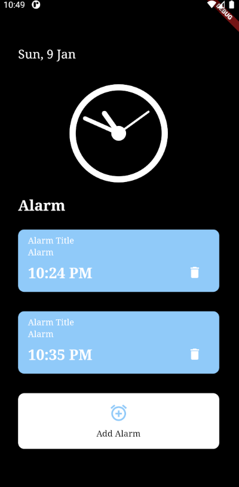
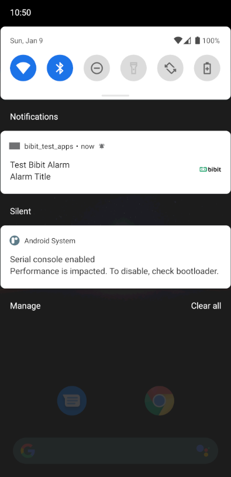
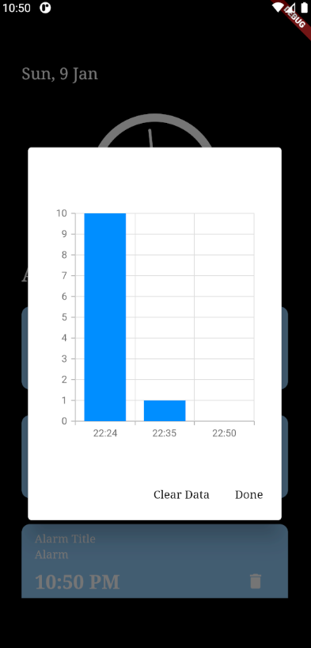

# bibit_test_apps

An alarm apps with local notifications, and vertical chart (Y-axis should be how many minute taken each time, and X-axis should be each alarm bell that rang)

## Getting Started
To run project : 
flutter run

## Screenshots App

  

Alarm Page View with: 
    - Clock Widget 
    - Alarm Widget 
    - Create Alarm Widget 
    - List Alarm Widget 

  

Notification badge with: 
    - Alarm Title 
    - Alarm Image 
    - With Notification Sound 

  

Showdialog with vertical chart: 
    - x is Time Alarm set 
    - y is How many minute taken each time 

